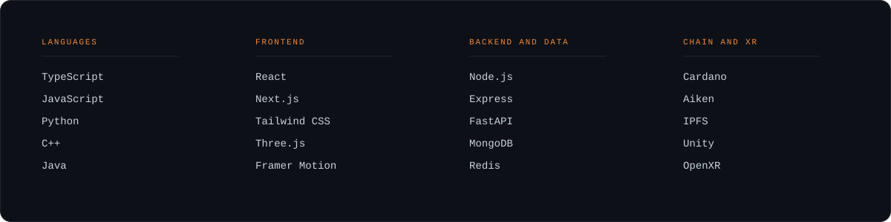

Final-year CS student at VIT Vellore. I mostly build full-stack web apps, with some XR and blockchain work alongside.

Currently an XR developer at an early-stage BCI startup. A lot of what I have shipped started as a hackathon project and then kept going.

### Selected work

| Project | What it is | Built with |
| --- | --- | --- |
| **[Donkey](https://github.com/vaibhav700c/donkey)** | A healthcare records vault where records stay encrypted at rest and access is granted on chain. Won the Cardano Hackathon, 1st of 200+ teams. | Cardano, Aiken, Next.js, IPFS |
| **[Wingman AI](https://github.com/vaibhav700c/wingman-ai)** | A browser extension that reads a live meeting transcript, suggests what to say next, and writes up the minutes afterwards. | React, FastAPI, Hugging Face, MongoDB |
| **[DEVSOC'25](https://github.com/CodeChefVIT/devsoc-landing-25)** | Landing page and admin portal for VIT's flagship hackathon. Held 1,500 concurrent users at launch. | Next.js, Framer Motion, ShadCN |

### Elsewhere

[LinkedIn](https://www.linkedin.com/in/vaibhav-jangid-461b3128a/) · vaibhavjangid128@gmail.com
